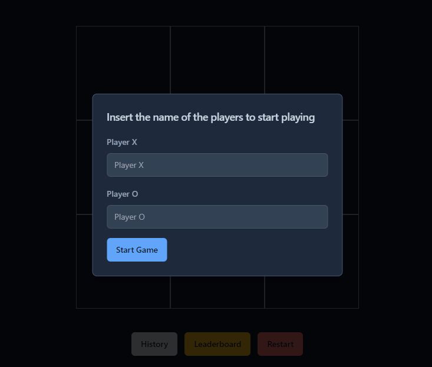
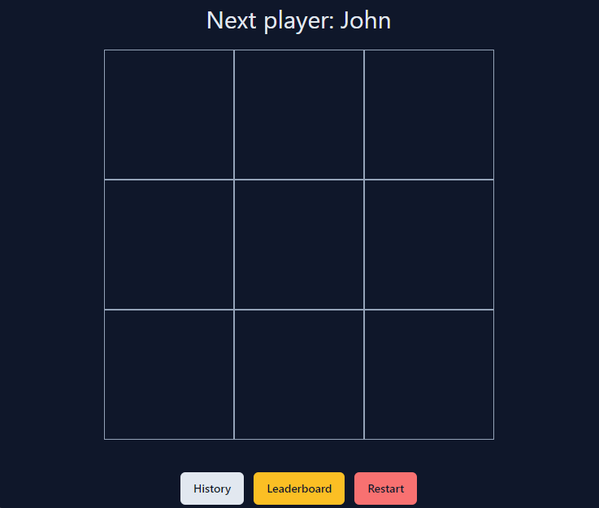
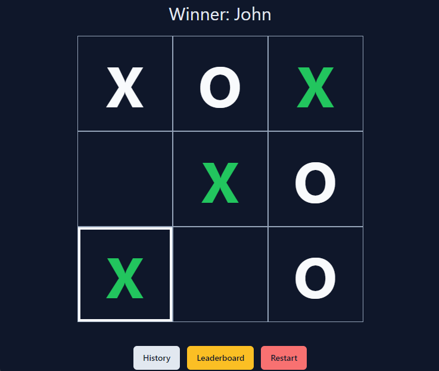
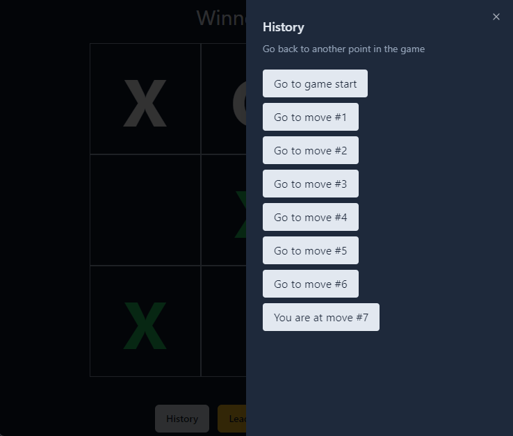
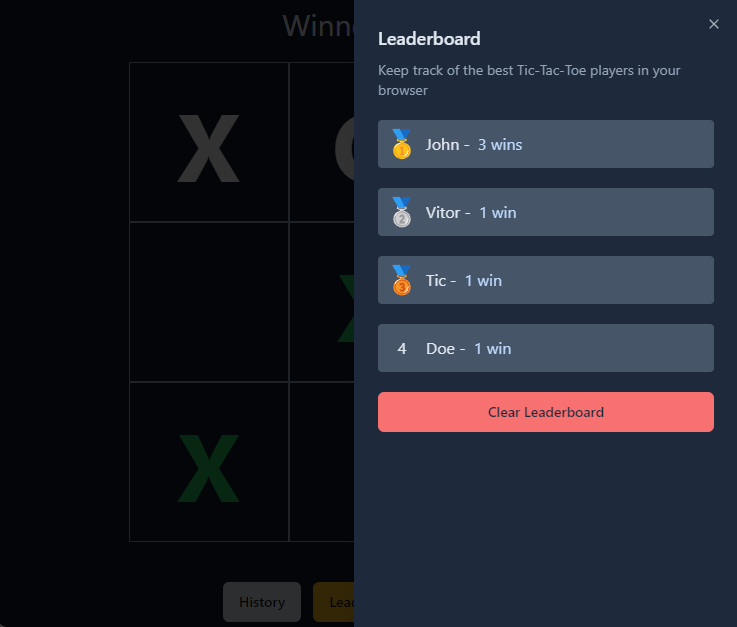

# Tic Tac Toe

This project is a Tic Tac Toe game inspired by React's official tutorial. In addition to the basic game functionality, it includes a leaderboard feature to track player scores.

## Table of Contents

- [Requirements](#requirements)
- [Installation](#installation)
- [Usage](#usage)
- [Features](#features)
- [License](#license)

## Requirements

- [Node.js](https://nodejs.org/)

## Installation

To get started with this project, clone the repository and install the necessary dependencies:

```bash
git clone https://github.com/VitorST1/React-TicTacToe.git
cd React-TicTacToe
npm install
```

## Usage

To run the project locally, use the following command:

```bash
npm run dev
```

This will start the development server and you can view the game in your browser at `http://localhost:5173`.

## Features

- **Basic Gameplay**: Play the classic Tic Tac Toe game.
- **Leaderboard**: Track player scores and display them on a leaderboard. Saved on local storage.
- **Move History**: View the history of moves made during the game.

## Preview

Players Modal:  


Game Board:  


Player Win:  


Moves History:  


Leaderboard:  


## License

This project is licensed under the MIT License. See the [LICENSE](LICENSE) file for more details.
